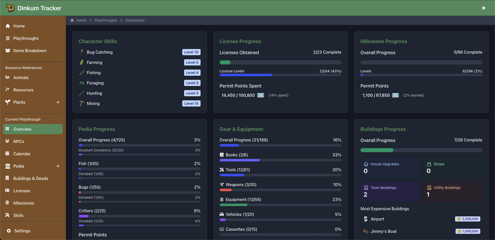

# Dinkum Tracker

A comprehensive tracking application for your Dinkum adventures. Manage multiple playthroughs, track collections, and monitor progress all in one place - all saved locally in your browser.



## 🌟 Features

- **Multiple Playthrough Support**: Create and manage separate playthroughs for different Dinkum game saves
- **Comprehensive Collection Tracking**:
  - 🐟 Fish (45+ species)
  - 🦋 Bugs (50+ species)
  - 🦀 Critters (25+ species)
- **Progress Monitoring**:
  - 📅 Calendar with events and birthdays
  - 🏆 Milestones (65+ in-game achievements)
  - 🎓 Skills tracking
  - 📜 License progression
  - 🏠 Building construction
  - 👫 NPC relationships
- **Complete Item Database**:
  - 📚 Books
  - 🔨 Tools
  - ⚔️ Weapons
  - 🎒 Equipment
  - 🚗 Vehicles
  - 👕 Clothing
  - 🪑 Furniture
  - 📝 Recipes (Cooking, Crafting, Sign Writing)
  - 💎 Resources (Minerals, Relics, Foragables, etc.)
- **Detailed Analysis**:
  - 📊 Dashboard with progress statistics
  - 🧮 Items breakdown for crafting purposes
  - 🏷️ Advanced filtering and search capabilities
- **Local Storage**: All data saved in your browser - no account needed
- **Data Management**:
  - 💾 Export/import data for backup and transfer
  - 🔄 Reset functionality
- **Responsive Design**: Works on desktop and mobile devices
- **Dark Mode Support**: Toggle between light and dark themes
- **Weight Calculator**: Ability to calculate Weighted Items price

## 🔧 Technology Stack

- **Next.js 15.3.0**: Modern React framework with App Router
- **React 19**: Latest React features and improvements
- **TypeScript**: Type-safe code development
- **Tailwind CSS 4.1.0**: Utility-first styling approach
- **Flowbite-React**: UI component library built on Tailwind
- **Zustand**: State management for persistent UI state
- **React-Toastify**: Toast notifications for user feedback
- **React-Icons**: Comprehensive icon library
- **LocalStorage API**: Client-side data persistence

## 📋 Project Structure

```text
dinkum-tracker/
├── app/                   # Next.js pages
│   ├── (home)/            # Home page components
│   ├── playthrough/       # Playthrough management
│   │   ├── [id]/          # Dynamic routes for each playthrough
│   │   ├── list/          # Playthrough listing
│   │   └── new/           # Create new playthrough
│   ├── settings/          # App settings
│   ├── itemsBreakdown/    # Items analysis
│   ├── weight-calculator/ # Weight Calculator for weighted items
│   └── globals.css        # Global styles
├── components/            # React components
│   ├── playthrough/       # Playthrough-specific components
│   │   ├── dashboard/     # Dashboard components
│   │   └── ui/            # Reusable UI components for playthrough
│   └── layout/            # Layout components (Sidebar, Navigation)
├── data/                  # Game data
│   ├── constants/         # App constants
│   └── dinkum/            # Game-specific data
│       ├── pedia/         # Collectible item data
│       └── ...            # Other game data (buildings, licenses, etc.)
├── lib/                   # Utility functions
│   ├── localStorage.ts    # Storage operations
│   └── services/          # Application services
├── types/                 # TypeScript type definitions
│   ├── app/               # Application-specific types
│   ├── dinkum/            # Game data types
│   └── ui/                # UI component types
└── public/                # Static assets
```

## 🚀 Getting Started

### Prerequisites

- Node.js 22 or later
- pnpm 10.0.0 or later (recommended) or npm/yarn

### Installation

1. Clone the repository:

   ```bash
   git clone https://github.com/chiefpansancolt/dinkum-tracker.git
   cd dinkum-tracker
   ```

2. Install dependencies:

   ```bash
   pnpm install
   # or
   npm install
   ```

3. Start the development server:

   ```bash
   pnpm dev
   # or
   npm run dev
   ```

4. Open your browser and navigate to `http://localhost:3000`

## 💾 Data Storage

This application stores all data in your browser's localStorage. This means:

- All data is saved locally on your device
- Data persists between browser sessions
- Clearing browser data will remove your saved playthroughs
- Data is not synced between devices
- Use the export/import feature to backup or transfer your data

## 🔍 Usage

### Managing Playthroughs

1. **Create a Playthrough**: Start by creating a new playthrough with a memorable name
2. **View Dashboard**: See your overall progress and statistics at a glance
3. **Navigate Features**: Use the sidebar to access different tracking features

### Tracking Collections

- **Fish, Bugs, and Critters**: Mark items as collected and donated to the museum
- **Advanced Filtering**: Filter by season, biome, time of day, or rarity
- **Search**: Find specific items by name

### Monitoring Progress

- **Milestones**: Track achievement completion
- **Licenses**: Monitor license acquisition
- **Skills**: Record skill level progression
- **Buildings**: Track building construction
- **NPC Relationships**: Manage relationships with town NPCs

### Managing Items

- **Recipes**: Track unlocked cooking, crafting, and sign writing recipes
- **Equipment**: Keep track of tools, weapons, equipment, and vehicles
- **Items Breakdown**: Analyze resource usage and requirements

### Calendar

- **Season and Day**: Keep track of the current day and season in your game
- **Events**: View upcoming events and birthdays
- **Planning**: Plan your activities based on seasonal availability

## 📋 Changelog

See [CHANGELOG.md](CHANGELOG.md) for a full history of releases and changes.

## 🌐 Live Demo

[Try Dinkum Tracker Online](https://dinkum-tracker.app)

## 🤝 Contributing

Contributions are welcome! Here's how you can help:

1. Fork the repository
2. Create a new branch (`git checkout -b feature/amazing-feature`)
3. Make your changes
4. Commit your changes (`git commit -m 'Add some amazing feature'`)
5. Push to the branch (`git push origin feature/amazing-feature`)
6. Open a Pull Request

## 📝 License

This project is licensed under the MIT License - see the LICENSE file for details.

## 📢 Disclaimer

This project is not affiliated with, endorsed by, or connected to Dinkum or its creators. All game data is sourced from the [Dinkum Wiki](https://dinkum.fandom.com/wiki/Dinkum_Wiki). Game images and names are used for reference purposes only.
